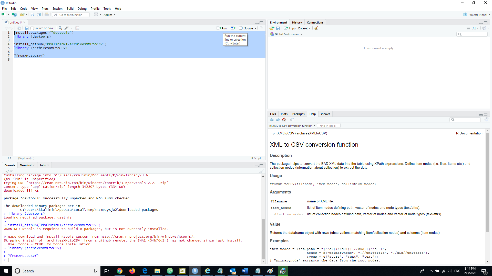
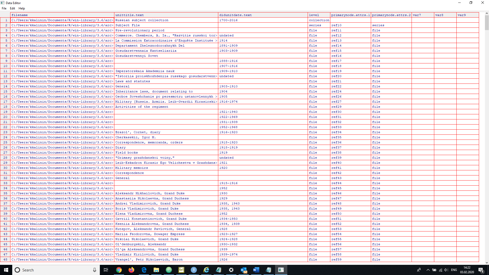

# CECscraper

**archivesXMLtoCSV** is an open source tool specifically designed 
to convert *EAD*-files (i.e. *Encoded Archival Description* files) from *.xml* to *.csv* format.
The following step-by-step instructions will guide you through setting up the package.

First,	install [**R**](https://cran.r-project.org/bin/windows/base/) and [**RStudio Desktop (Free Edition)**](https://rstudio.com/products/rstudio/download/).

Second,	open **RStudio**.	Install *devtools* package and load it into current **R** session.
      
    install.packages ("devtools") 
    library (devtools)
    
Third, install *archivesXMLtoCSV* package from **GitHub** and load it into **R**

    install_github("kkalininMI/archivesXMLtoCSV")
    library (archivesXMLtoCSV)

Fourth, check if the package is properly loaded and documentation page for *fromXMLtoCSV()* function is opened by using "?".  

    ?fromXMLtoCSV()

This function will be used to convert our data from *.xml* to *.csv* format.  

Fifth, the function uses three input arguments: *filename*, *collection*-level nodes and *item*-level nodes containing path expressions to select node-sets. 

Path expressions are defined via *XPath* (*XML Path Language*) which is a query language for selecting nodes from an *XML* document.  A helpful guide on *XPath* can be found [online reference](https://en.wikipedia.org/wiki/XPath) or in the Nolan's book (2014).  Using *XPath* we are able to define node-sets, first, by stating the root path [*path*], second, by listing the nodes of interest on the path [*nodes*], and third, by specifying data type [*types*] (*"attrs"* for attribute nodes and *"text"* for text nodes).  Note that the vectors for nodes and data types must be of the same length. Also, the list of nodes can include the *XML* nodes that are missing from current *XML* file, meaning that you can store many auxiliary nodes without having to worry about running into an error.  

Let's define item nodes and collection nodes in terms of two list objects: *item_nodes* and *collection_nodes* that include *path*, *nodes* and *types* as vectors of elements.  Both nodes and types must be of the same length. 

    item_nodes = list(path = "(//c)|(//c01)|(//c02)|(//c03)",
                      nodes = c("primarynode", ".//unittitle", "./did//unitdate"),
                      types = c("attrs", "text", "text"))
    
    #Note: "primarynode" extracts the data from the root nodes.

    collection_nodes <- list(path="archdesc[@level='collection']",
                             nodes=c(".//unittitle", "./did//unitdate"),
                             types=c("text", "text"))

Note that you might want to set as many alternative paths as you wish, since the content of your XML files might vary in terms of paths; same is true for the nodes and their types.  By adding more node paths that vary in terms of names, i.e. *"(//c)|(//c01)|(//c02)|(//c03)|(//c04)|(//c05)|(//c06)|(//c07)|(//c08)|(//c09)"* you can gain greater extractive capacity of the algorithm.

Sixth,  after all our nodes are defined, let's test the *fromXMLtoCSV()* function on internal data file.

    filename <- system.file("rusdata.xml", package="archivesXMLtoCSV")
    filedata <- fromXMLtoCSV(filename, item_nodes, collection_nodes)

Let's take a look at the *filedata* object

    edit(filedata)

Seventh, now we can save coverted XML results into a *.csv* file:
    
    write.csv(filedata, "C:/data_from_xml_to_csv.csv")

